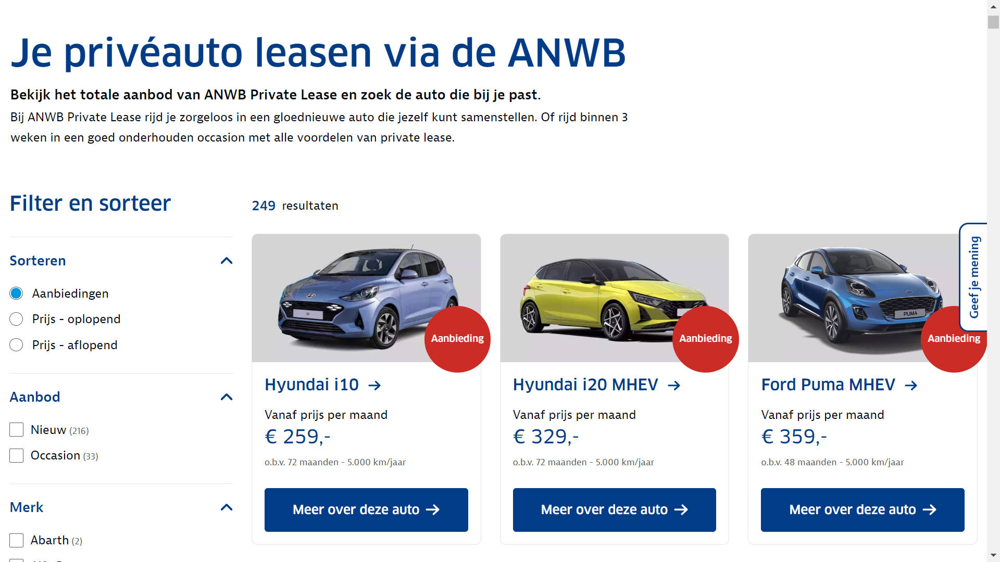
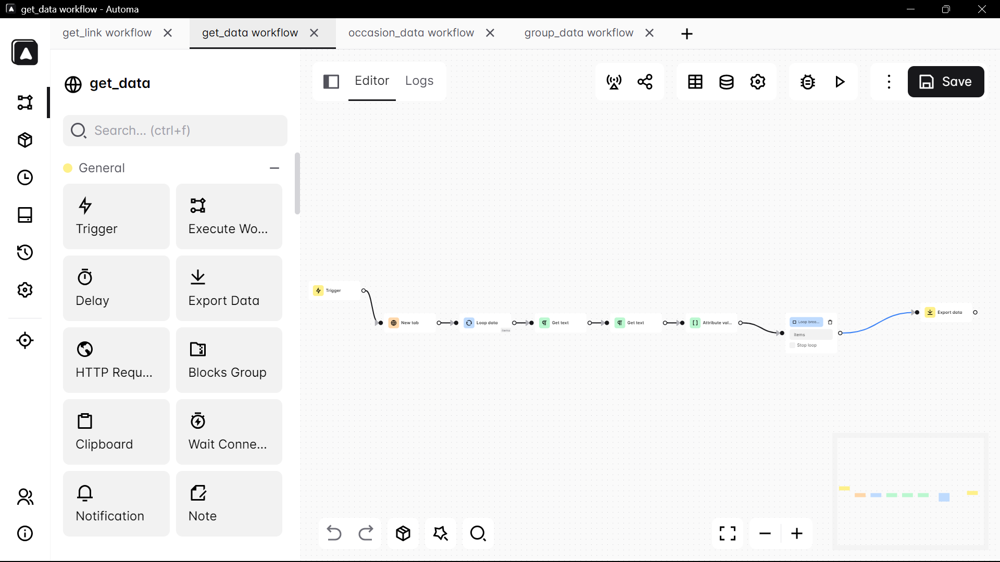

# Web Scraping Leasing Car Data from anwb.nl using Automa Extensions & BeautifulSoup

**Goal**: Scrape all private lease cars on www.anwb.nl with their pricing and some additional specifications.

**Description**: To gather intelligence in the private lease market, we would like to scrape all cars available on this URL:

> https://www.anwb.nl/auto/private-lease/anwb-private-lease/aanbod/

**The data we need (first car as example)**:
- Manufacturer (Fiat)
- Model (500)
- Price (256,-)
- Fuel type (Benzine)
- Vehicle Chassis (Hatchback)

**Desired output:**
1. CSV file containing the results.
2. The script used for the web scraping.

## The Website Page

## Example Automa Extensions

